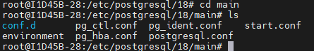

## SGBD
Instalar e configurar o SGBD PostgreSQL

O comando para instalar o SGBD:

```bash 
sudo apt install -y postgresql
```
>O comando sudo, no nosso caso, pode ser omitido pois já somos root.
---
Realizando veifição so SGBD:
```bash
pg_lsclusters
```

Para realizar o acesso ao SGBD **sem senha**
ulltilizar o comando:
```bash
sudo -u postgres psql
```
A nossa porta é a porta 5432
>Com esse comando esse o acesso é feito sem senha, pois o Linux já provou quem você é (root). Autenticação PEER.

Para primeiro acesso alterei a senha:

```sql
ALTER USER postegres PASSWORD 'novasenha';
```

>O retorno correto, é `ALTER ROLE`.

Para sair do postgres, comando `\q` (igual o \quit de vários jogos).


## Configuracoes de Serviço 
>Caminho padrão para as configurações SQL


**Primeira configuração:
```bash
sudo nano postgresql.conf
```
CTRL + W para buscar a linha do listen_addresses e descomentamos

Se ficar localhost, somente o meu PC acessa.

Passo 2:
```bash
sudo nano pg_hba.conf
```
Nas últimas linhas, adicionei:
host all all 10.87.38.0/24 scram-sha-256

Para criar um banco de dados usamos o comando 
```sql
CREATE DATABASE lojamax;
```
Para visualizar os bancos:
```bash
\l 
```
Para sair:
```bash
q
```

