## Análise de Dados
Para verificar se um banco de dados existe, antes de apagar:
```sql
DROP DATABASE IF EXISTS nome;
```
---

Criamos um banco de dados chamado
```sql
CREATE DATABASE pichau;
```
---
Para criar uma tabela 
```sql
CREATE TABLE produtos(
 id SERIAL PRIMARY KEY,
 nome VARCHAR(100) NOT NULL,
 categoria VARCHAR(50) NOT NULL,
 preco DECIMAL(10,2),
 estoque INTEGER NOT NULL
);
```
---
Para verificar a quantidade de linhas da nossa base de dados:
```sql
SELECT COUNT(*)
FROM produtos;
```
---
Filtro de colunas e limitação de saídas:
```sql
SELECT nome,preco
FROM produtos LIMIT
10;
```
---
Para verificar a quantidade e tipos diferentes de categorias:
```sql
SELECT DISTINCT
categoria FROM
produtos ORDER BY   
categoria;
```
---
Filtro de colunas e categoria:
```sql
SELECT nome,preco,estoque 
FROM produtos
WHERE categoria =
'Monitores';
```
---
Filtro de preços:
```sql
SELECT nome,preco 
FROM produtos
WHERE preco <=1000;
```
---
Para faixas de preços:
```sql

SELECT nome,preco 
FROM produtos
WHERE preco >= 0 
AND preco <= 500;
```
---
Mais simples
```sql
SELECT nome,preco 
FROM produtos
WHERE preco BETWEEN
0 AND 500;
```
---
Selecionar algo 
```sql
SELECT nome,preco  
FROM produtos 
WHERE categoria                   
='Monitores' OR 
categoria 
='Notebooks'
```
---
Para achar algo tanto minusculo e maiusculo 
```sql
SELECT nome,preco
FROM produtos 
WHERE nome ILIKE
'Mouse%';
```
>% Operador coringa!

## Atividade

Primeiro eu criei um bando de dados no meu servidor chamado "livraria"
para isso u tive que entar no postgres no qual o comando para entar sem senha é `sudo -u postgres psql` após isso eu fiz CREATE DATABASE livraria que no caso é o nome do meu banco de dados depois eu dei um `\l` para ver meus bancos de dados e ver se o meu banco de dados foi criado para sair dei um `\q`   


Após isso eu conectei no meu VScode onde eu cliquei no mais depois coloque meu `IP` depois o `postgres` depois minha `senha` e por fim a porta para poder conectar meu banco de dados

 
Depois eu já criei a estrutura base para criar uma tabela onde O código `CREATE TABLE livros` serve para criar uma tabela chamada livros. O `id` é um número inteiro e é gerado automaticamente pelo banco, além de ser a chave principal da tabela. O `nome e o autor` usam *VARCHAR porque vão armazenar textos*. O `preco` usa *NUMERIC(10,2) para guardar valores com duas casas decimais*. O `genero` também é um *texto* e o `estoque` é um *número inteiro* para indicar a quantidade de livros. Já o `ano_publicacao` guarda o ano em que o livro foi publicado. O *NOT NULL foi usado para impedir que esses campos fiquem vazios*.


Logo em seguida eu colei o texto do Professor e fui verificar se deu certo, porem ele duplicou de 200 foi para 400 tentei arrumar e foi para 600 então eu paguei todo e coloque os valores de novo deu certo deu 200 livros pórem a contagem foi a partir dos outros valores.


Bloco 1 — Reconhecimento da base

Objetivo: aprender a visualizar uma base de dados

 

1. Exiba todos os dados da tabela, mas limitando o resultado aos 10 primeiros registros.
Para fazer esse usei 
```sql
SELECT *
FROM livros
LIMIT 10;
```
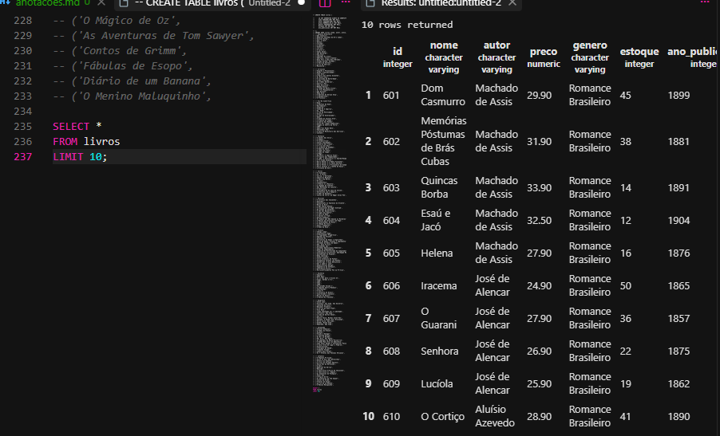
O SELECT * mostra todas as colunas da tabela. O FROM livros indica que estamos buscando os dados da tabela livros. O LIMIT 10 limita o resultado aos 10 primeiros registros
---
2. Exiba apenas as colunas titulo, autor e preco de todos os livros.
Para fazer esse usei 
```sql
SELECT nome, autor, preco
FROM livros;
```
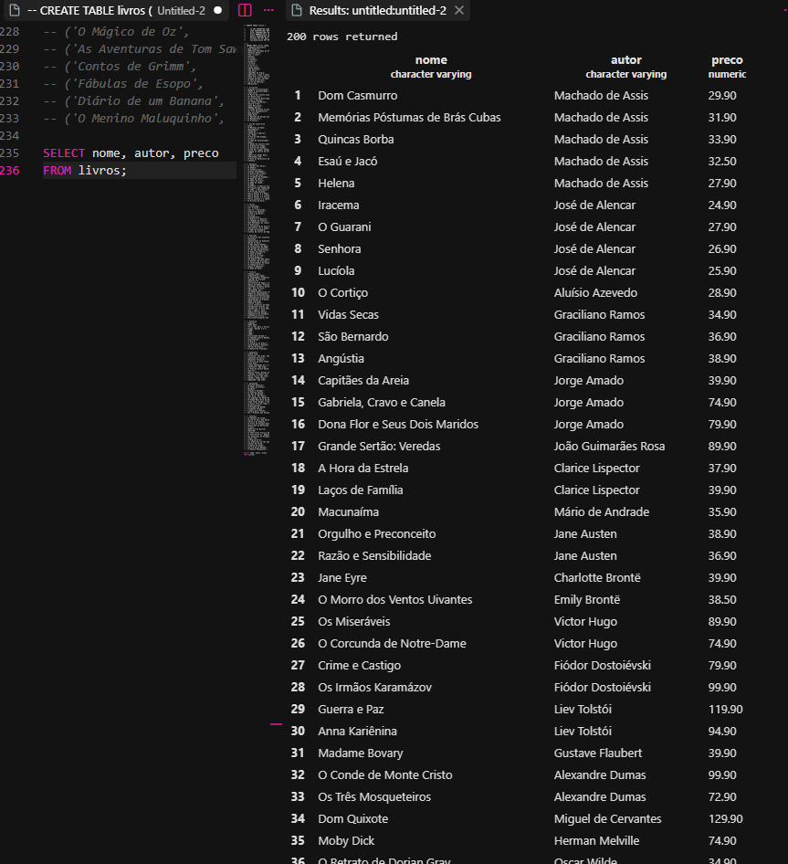
Aqui não usamos *, porque queremos escolher apenas algumas colunas. O resultado vai mostrar somente nome, autor e preço de todos os livros.
---

3. Liste os gêneros distintos existentes na base, em ordem alfabética.
Para fazer esse usei
```sql
SELECT DISTINCT genero
FROM livros
ORDER BY genero ASC;
```
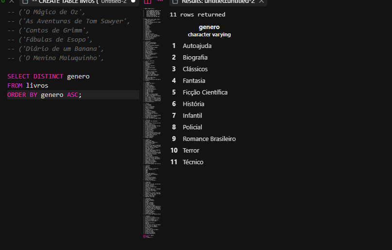

O DISTINCT remove os gêneros repetidos, deixando cada gênero apenas uma vez. O ORDER BY genero organiza os resultados pelo gênero. O ASC coloca em ordem crescente, ou seja, alfabética.
---

4. Descubra quantos autores diferentes existem.
Para fazer esse usei 
```sql
SELECT COUNT(DISTINCT autor) AS quantidade_autores
FROM livros;
```
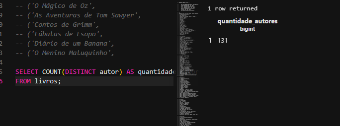

O COUNT conta quantos valores existem. O DISTINCT autor faz com que cada autor seja contado apenas uma vez. O AS quantidade_autores dá um nome mais fácil para a coluna do resultado.
---

5. Liste os 5 livros mais caros da base (título e preço).
Para fazer esse usei 
```sql
SELECT nome, preco
FROM livros
ORDER BY preco DESC
LIMIT 5;
```
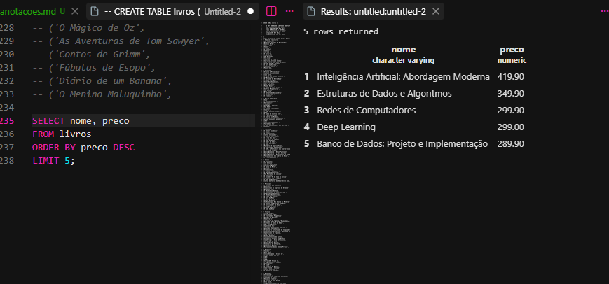
O ORDER BY preco DESC organiza os preços do maior para o menor. Depois, LIMIT 5 pega somente os cinco primeiros, mostrando assim os 5 livros mais caros.
---

6. Liste os 5 livros com menor estoque (título e estoque).
Para fazer esse usei 
```sql
SELECT nome, estoque
FROM livros
ORDER BY estoque ASC
LIMIT 5;
```
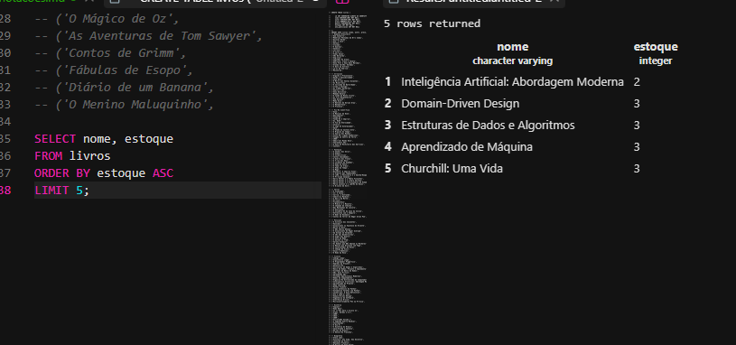

O ORDER BY estoque ASC organiza o estoque do menor para o maior. O LIMIT 5 mostra somente os cinco primeiros livros, ou seja, os que possuem menor estoque.
---

Bloco 2 — Filtros numéricos

Objetivo: dominar os operadores de comparação e o BETWEEN.

 

7. Mostre titulo e estoque de todos os livros do gênero Técnico.
Para fazer esse usei 
```sql
SELECT titulo, estoque
FROM livros
WHERE genero = 'Técnico';
```
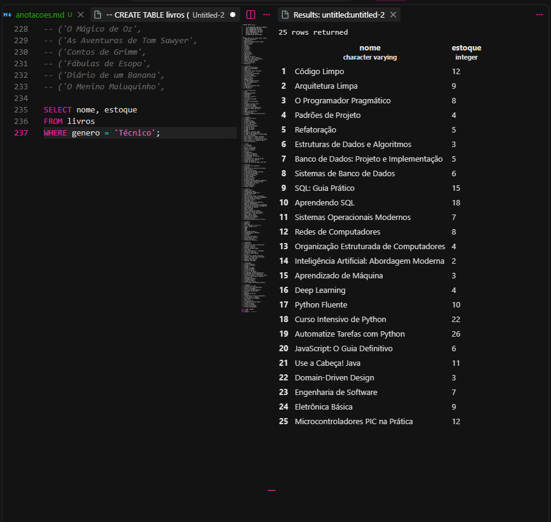

O WHERE serve para criar um filtro. Nesse caso, genero = 'Técnico' faz com que apareçam somente os livros cujo gênero seja Técnico.

---
8. Mostre titulo e preco dos livros que custam mais de R$ 200,00.
Para fazer esse usei 
```sql
SELECT nome, preco
FROM livros
WHERE preco > 200;
```
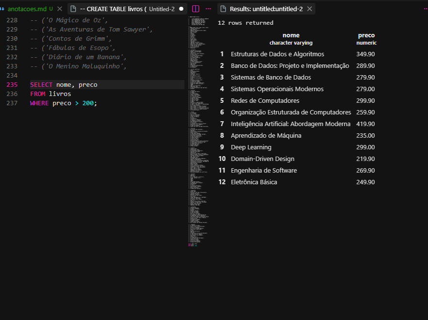

O > significa maior que. Então o código seleciona apenas os livros cujo preço seja maior que 200.

---
9. Mostre titulo e preco dos livros com preço entre R$ 40,00 e R$ 70,00.
Para fazer esse usei 
```sql
SELECT nome, preco
FROM livros
WHERE preco BETWEEN 40 AND 70;
```
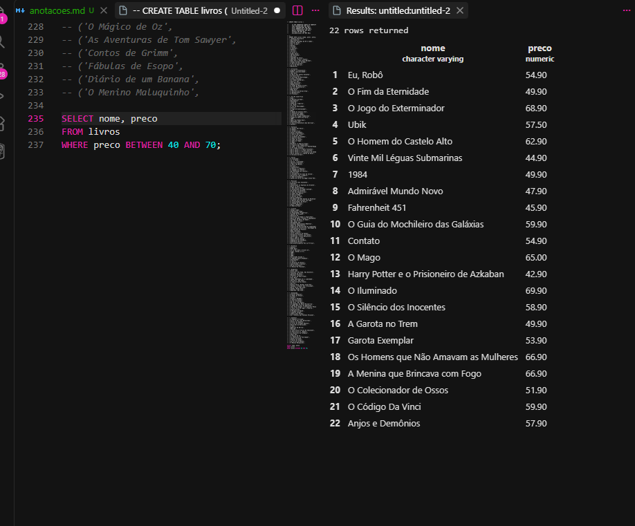

O BETWEEN serve para procurar valores dentro de um intervalo. Nesse caso, ele pega os livros com preço de 40 até 70, incluindo os valores 40 e 70.
---

10. Mostre os livros com estoque abaixo de 5 unidades (situação de reposição urgente).
Para fazer esse usei 
```sql
SELECT nome, estoque
FROM livros
WHERE estoque < 5;
```
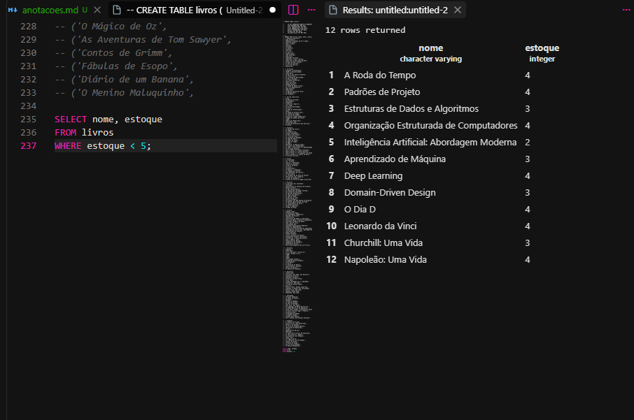

O < significa menor que. Portanto, serão mostrados somente os livros que possuem menos de 5 unidades em estoque.

---

11. Liste os livros publicados antes de 1900, ordenados do mais antigo para o mais recente.
Para fazer esse usei 
```sql
SELECT nome,ano_publicacao
FROM livros
WHERE ano_publicacao < 1900
ORDER BY ano_publicacao ASC;
```
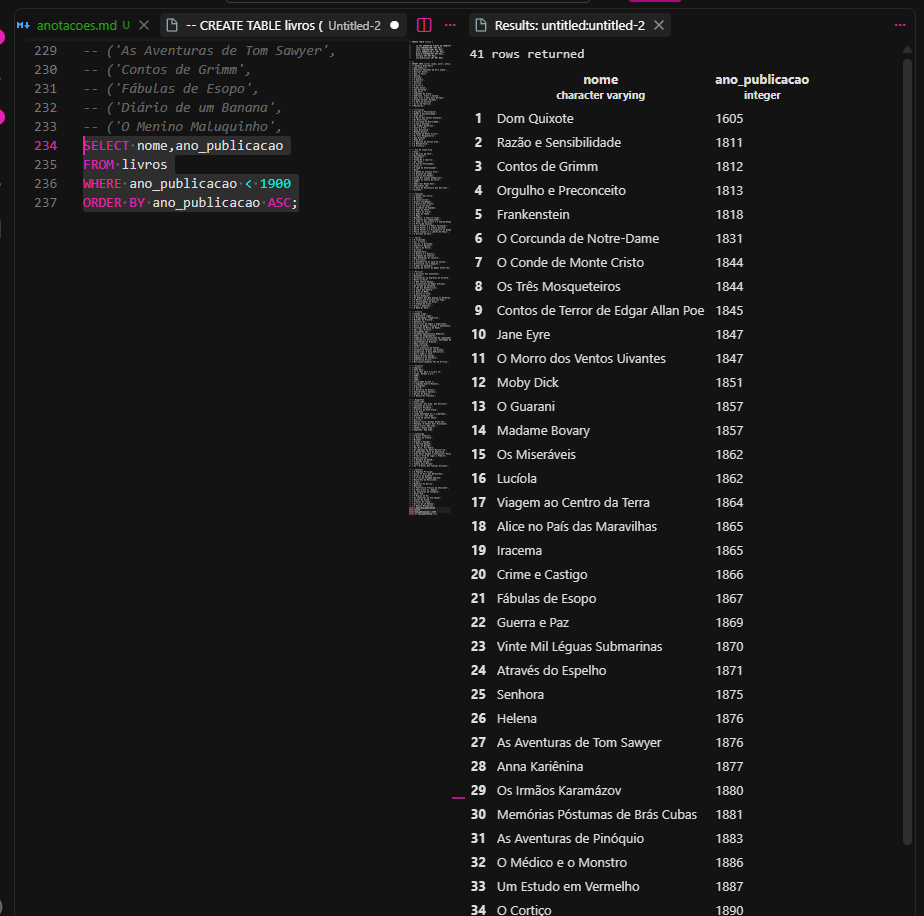

O WHERE ano < 1900 seleciona somente os livros publicados antes de 1900. Depois, ORDER BY ano ASC organiza os livros do mais antigo para o mais recente.
---

12. Liste os livros publicados entre 2010 e 2020, mostrando título, ano e gênero.
Para fazer esse usei 
```sql
SELECT nome, ano_publicacao, genero
FROM livros
WHERE ano_publicacao BETWEEN 2010 AND 2020;
```
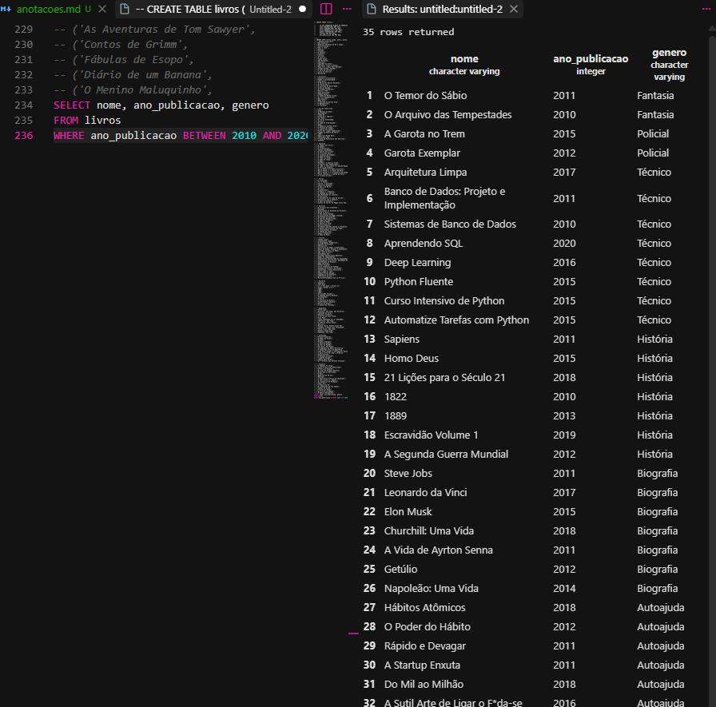

O BETWEEN 2010 AND 2020 seleciona os livros publicados entre esses dois anos. O SELECT mostra somente título, ano e gênero.
---


