para fazer contagem DE LINHAS 

```sql
SELECT COUNT(*) 
from Produtos;
```
para identificar melhor as colunas e "nomiar"

```sql
SELECT COUNT(*) 
AS totalregistros 
FROM produtos;
```

para verificar o estoque 

```sql
SELECT COUNT(*) 
AS produtos_baixo_estoque 
FROM produtos 
WHERE estoque < 5;
```
*para inverter basta colocar > ou melhor seria colocar ">="*

para ver o total de alguma coisa 

```sql
SELECT COUNT(*) AS total_perifericos
FROM produtos
WHERE categoia = 'Perifericos';
```

o COUNT(*) já é uma função e contagem

para ver o maior numero 

```sql
SELECT MAX(preco)
AS maior_preco
FROM produtos;
```

para ver o menor numero 

```sql
SELECT MIN(preco)
AS menor_preco
FROM produtos;
```

para ter a media de uma coluna 

```sql
SELECT AVG(preco)
AS media_produtos
FROM produtos;
```

para fazer uma media correta 

```sql
SELECT ROUND(AVG (preco),2) 
AS media_correta
FROM produtos;
```

para fazer tudo de uma vez, ver media, maior preo e menor preco 

```sql
SELECT 
MAX(preco) AS maior_preco,
MIN(preco) AS menor_preco,
ROUND(AVG (preco),2) AS media 
FROM produtos;
```

para fazer soma 

```sql
SELECT SUM(estoque) 
AS total_produtos
FROM produtos;
```

para ver tudo media, maxio, minimo e soma 

```sql
SELECT 
MAX(preco) AS maior_preco,
MIN(preco) AS menor_preco,
ROUND(AVG (preco),2) AS media,
SUM(estoque) AS total_produtos
FROM produtos;
```

para saber seu faturamente vendendo tudo 

```sql
SELECT SUM(preco * estoque ) AS 
total_faturamento_por_produto
FROM produtos;
```


# Atividade 

Primerio eu deletei todos os produtos do banco de dados terabyte para colocar novos produtos;
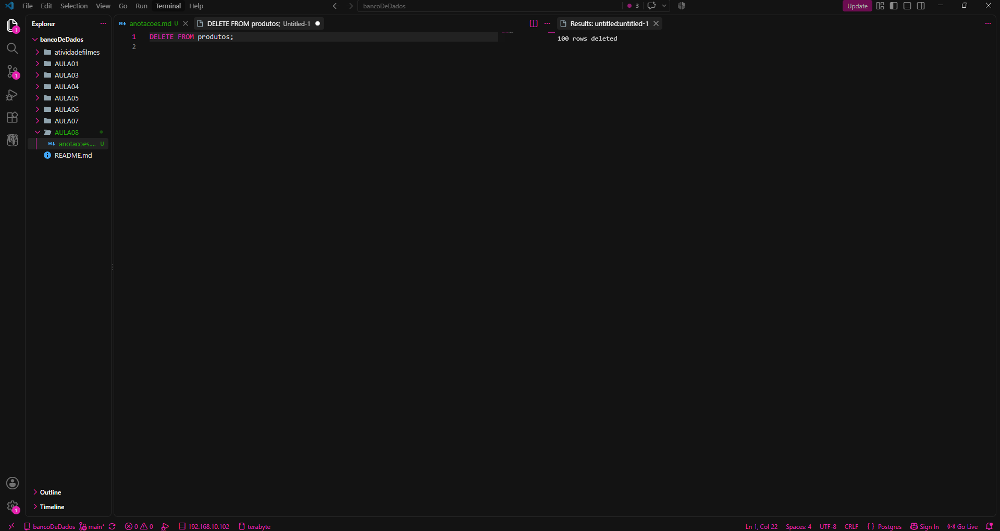
Após eu deletar eu coloquei as novas informações
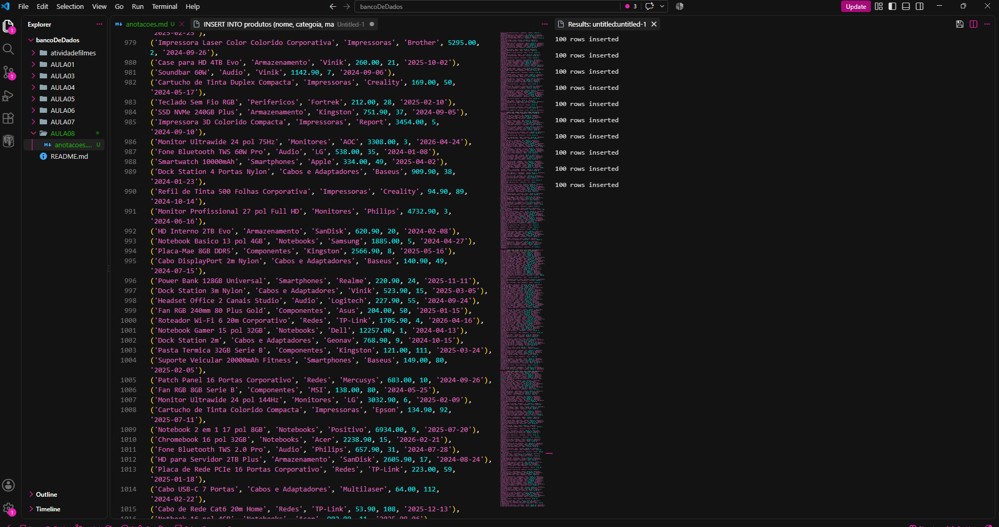

Depois eu já começei a fazer a parte um da atividades

### Parte A 

PARTE A — CONSULTAS E FILTROS

A1. Liste o nome e o preço de todos os produtos da categoria Monitores.

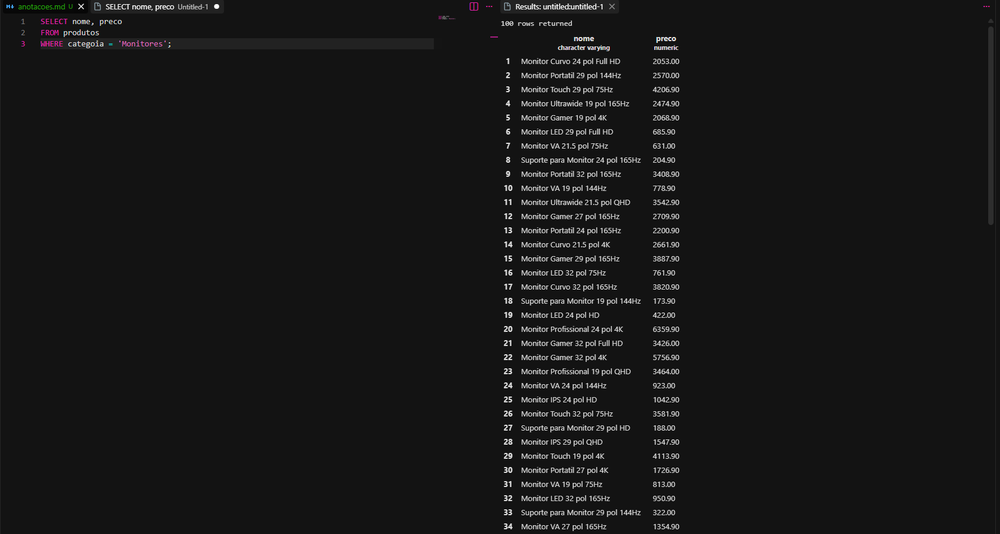
Nessa primeira consulta, eu quis mostrar somente o nome e o preço dos produtos que pertencem à categoria Monitores.
Eu usei o SELECT para escolher as colunas que eu queria visualizar, nesse caso nome e preco.
Depois usei o FROM produtos para indicar que essas informações seriam buscadas na tabela produtos.
Por último, usei o WHERE para filtrar apenas os produtos cuja categoria é Monitores.
```sql
SELECT nome, preco
FROM produtos
WHERE categoia = 'Monitores';
```

A2. Liste todos os produtos com estoque menor que 5 unidades, mostrando nome, categoria e estoque.

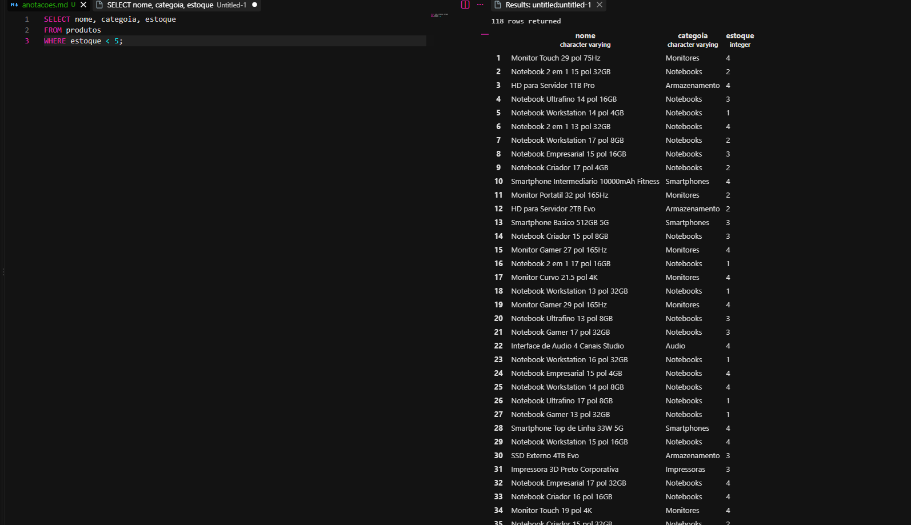
No SELECT, escolhi mostrar o nome, a categoria e a quantidade em estoque.
Usei FROM produtos para buscar os dados na tabela.
E no WHERE coloquei estoque < 5, que significa que o estoque precisa ser menor que 5 para aparecer no resultado.
```sql
SELECT nome, categoia, estoque
FROM produtos
WHERE estoque < 5;
```

A3. Liste os 10 produtos mais caros da loja (nome e preço), do mais caro para o mais barato.

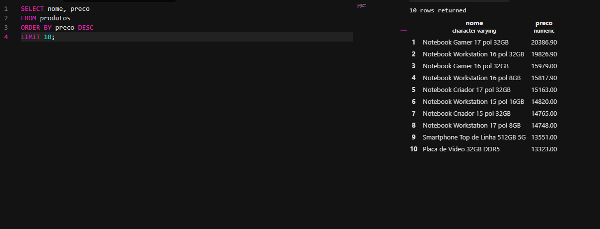
Nessa consulta, eu quis encontrar os 10 produtos mais caros da loja.
Primeiro selecionei o nome e o preço.
Depois usei ORDER BY preco DESC para ordenar os produtos pelo preço, começando do maior para o menor.
O DESC significa ordem decrescente.
Por fim, usei LIMIT 10 para mostrar somente os 10 primeiros produtos da lista.
```sql
SELECT nome, preco
FROM produtos
ORDER BY preco DESC
LIMIT 10;
```

A4. Liste os produtos da marca Logitech, ordenados por preço crescente.

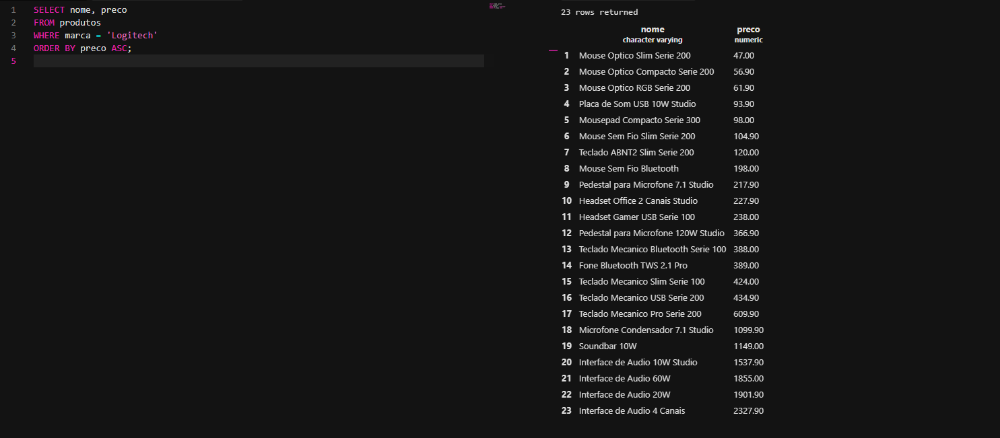
Nessa consulta, eu filtrei somente os produtos da marca Logitech.
Usei WHERE marca = 'Logitech' para selecionar apenas essa marca.
Depois usei ORDER BY preco ASC para organizar os produtos pelo preço em ordem crescente, ou seja, começando pelo mais barato e indo até o mais caro.
```sql
SELECT nome, preco
FROM produtos
WHERE marca = 'Logitech'
ORDER BY preco ASC;
```

A5. Liste os produtos com preço entre R$ 100,00 e R$ 500,00, mostrando nome e preço.

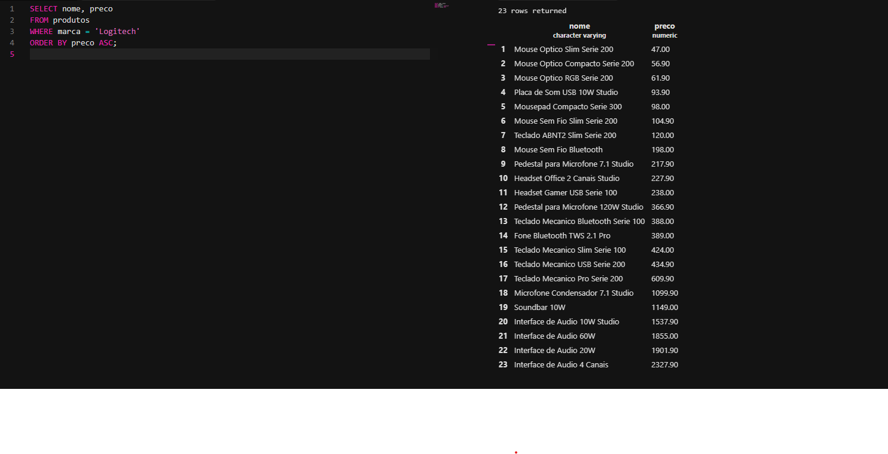
Nessa última consulta da Parte A, eu procurei os produtos que possuem preço entre R$100 e R$500.
Novamente selecionei apenas o nome e o preço.
Usei o WHERE para fazer o filtro e o BETWEEN 100 AND 500 para definir os preços que eu queria pesquisar.
```sql
SELECT nome, preco
FROM produtos
WHERE preco BETWEEN 100 AND 500;
```

### Parte B

PARTE B — FUNÇÕES DE AGREGAÇÃO

B1. Quantos produtos existem cadastrados na loja? Dê ao resultado o nome total_de_produtos.

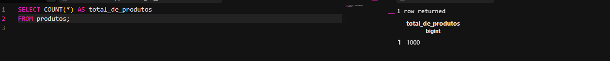
Nessa consulta, eu quis descobrir quantos produtos estão cadastrados na tabela.
Para isso, usei a função COUNT(*), que conta a quantidade de registros da tabela.
Também usei AS total_de_produtos para colocar um nome mais fácil de entender no resultado.
```sql
SELECT COUNT(*) AS total_de_produtos
FROM produtos;
```

B2. Quantos produtos estão com estoque abaixo de 10 unidades? Nomeie a coluna como produtos_em_falta.

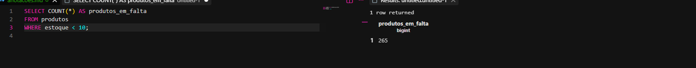
Nessa consulta, eu quis saber quantos produtos estão com o estoque abaixo de 10 unidades.
Usei o COUNT(*) para contar os produtos e o WHERE estoque < 10 para filtrar somente aqueles que possuem menos de 10 unidades no estoque.
Também coloquei AS produtos_em_falta para dar um nome mais compreensível para o resultado.
```sql
SELECT COUNT(*) AS produtos_em_falta
FROM produtos
WHERE estoque < 10;
```

B3. Qual o maior e o menor preço da loja? Traga os dois na mesma consulta, com os nomes maior_preco e menor_preco.

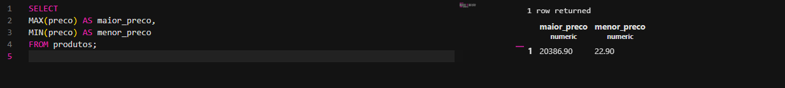
Nessa consulta, eu procurei o maior e o menor preço existente na loja.
Usei a função MAX(preco) para encontrar o maior preço e MIN(preco) para encontrar o menor preço.
Coloquei os dois na mesma consulta para aparecerem juntos no resultado.
```sql
SELECT
MAX(preco) AS maior_preco,
MIN(preco) AS menor_preco
FROM produtos;
```

B4. Qual o preço médio dos produtos da categoria Notebooks, arredondado para 2 casas decimais?

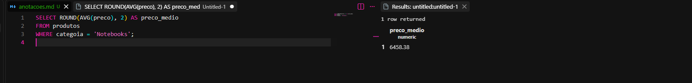
Nessa consulta, eu quis descobrir o preço médio dos produtos da categoria Notebooks.
Primeiro usei o WHERE para selecionar somente os produtos da categoria Notebooks.
Depois usei AVG(preco) para calcular a média dos preços.
Também usei ROUND(..., 2) para arredondar o resultado para duas casas decimais, deixando o valor no formato de preço.
```sql
SELECT ROUND(AVG(preco), 2) AS preco_medio
FROM produtos
WHERE categoia = 'Notebooks';
```

B5. Quantas peças a loja tem no total, somando o estoque de todos os produtos? Nomeie como total_de_pecas.

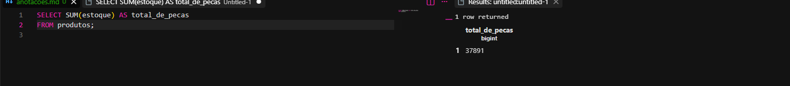
Nessa consulta, eu quis descobrir quantas peças a loja possui no total.
Para isso, usei a função SUM(estoque), que soma todas as quantidades existentes na coluna de estoque.
Também usei AS total_de_pecas para dar um nome mais claro ao resultado.
```sql
SELECT SUM(estoque) AS total_de_pecas
FROM produtos;
```

### Parte C 

PARTE C — PAINEL E CÁLCULOS

C1. Monte um painel resumo em uma única consulta, retornando de uma vez: quantidade de produtos, preço médio (2 casas decimais), maior preço, menor preço e total de peças em estoque. Todas as colunas devem ter nomes compreensíveis para o gerente.

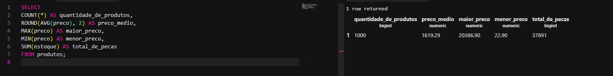
Nessa consulta, eu montei várias informações da loja em uma única consulta.
Usei COUNT(*) para saber a quantidade de produtos cadastrados.
Depois usei AVG(preco) para calcular o preço médio e ROUND para deixar o resultado com duas casas decimais.
Também usei MAX para descobrir o maior preço e MIN para descobrir o menor preço.
Por último, usei SUM(estoque) para saber a quantidade total de peças disponíveis no estoque.
Coloquei nomes nas colunas usando AS para deixar o resultado mais fácil de entender.
```sql
SELECT
COUNT(*) AS quantidade_de_produtos,
ROUND(AVG(preco), 2) AS preco_medio,
MAX(preco) AS maior_preco,
MIN(preco) AS menor_preco,
SUM(estoque) AS total_de_pecas
FROM produtos;
```

C2. O valor imobilizado de um produto não está gravado na tabela: ele precisa ser calculado (preço x estoque). Crie a coluna calculada valor_em_estoque e mostre os 5 produtos com maior valor imobilizado, exibindo nome, preço, estoque e o valor calculado.

(Primeiro eu fui pesquisar o que é um Valor Imobilizado. Resultado da pesquisa: O valor imobilizado (ou ativo imobilizado) corresponde ao conjunto de bens físicos e tangíveis que uma empresa possui e utiliza em suas operações diárias para gerar receita, com vida útil superior a um ano.)
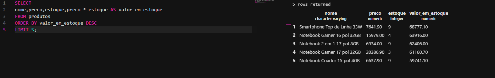
Nessa consulta, eu quis descobrir quais são os produtos que possuem o maior valor total parado(Imobilizado) no estoque.
Para isso, mostrei o nome, o preço e a quantidade em estoque.
Depois fiz um cálculo multiplicando preco * estoque, criando uma nova coluna chamada valor_em_estoque.
Esse cálculo mostra quanto vale todo o estoque daquele produto.
Depois usei ORDER BY valor_em_estoque DESC para colocar os maiores valores primeiro.
Por fim, usei LIMIT 5 para mostrar somente os cinco produtos com maior valor em estoque.
```sql
SELECT
nome,preco,estoque,preco * estoque AS valor_em_estoque
FROM produtos
ORDER BY valor_em_estoque DESC
LIMIT 5;
```

C3. Compare o resultado de C2 com o produto mais caro que apareceu em A3. É o mesmo item? Escreva duas linhas explicando o que essa comparação revela sobre o estoque da loja.

O produto mais caro da loja é o Notebook Gamer 17 pol 32GB, com preço de R$ 20.386,90, mas ele não possui o maior valor em estoque.
Isso mostra que o valor em estoque depende não apenas do preço do produto, mas também da quantidade de unidades disponíveis.


