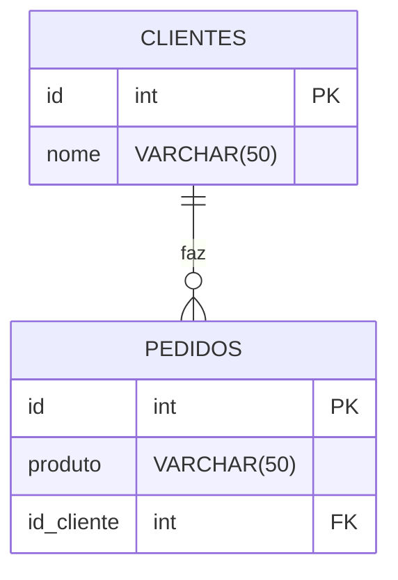

## Relacionamentos entre tabelas

- Ideia principal: Um cliente pode possuir varioes pedidos.

## Diagrama



1- Primeiro criamos nossa tabela:
```sql
CREATE TABLE clientes(
    id SERIAL PRIMARY KEY,
    nome VARCHAR(50) NOT NULL
);
```
2-Criamos a tabela de pedidos, referenciando com a coluna ID da tabela clientes:
```sql
CREATE TABLE pedidos(
    id SERIAL PRIMARY KEY,
    produto VARCHAR(50) NOT NULL,
    id_cliente INT REFERENCES clientes(id)
);
```
3- Inserimos clientes na nossa tabela clientes
```sql
INSERT INTO clientes(nome) VALUES
('Hannah'),
('Miguel'),
('Murilo'),
('Lucas');
```
4-inserimos os pedidos nos seus respectivos clientes:
```sql
INSERT INTO pedidos(produto,id_cliente) VALUES
('Chocolate',3),
('Salgado',1),
('Refri',2),
('Chocolate',1)
```

---

5-Para relacionar as duas tabelas 
```sql
SELECT clientes.nome,pedidos.produto
FROM pedidos
INNER JOIN clientes ON pedidos.id_cliente = clientes.id
```

6- Para ver o cliente menos se nao tiver pedido 
```sql
SELECT clientes.nome,pedidos.produto
FROM clientes
LEFT JOIN pedidos ON pedidos.id_cliente = clientes.id;
```

7- Para ver o o null
```sql
SELECT clientes.nome,pedidos.produto
FROM clientes
LEFT JOIN pedidos ON pedidos.id_cliente = clientes.id
WHERE pedidos.id IS NULL;
```