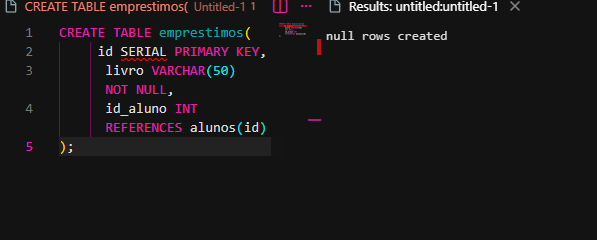
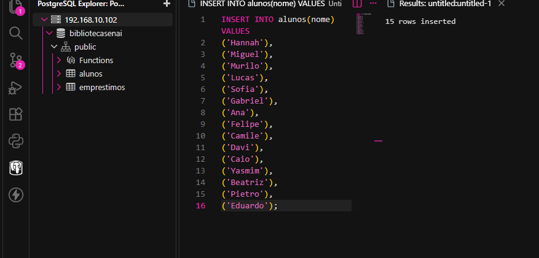
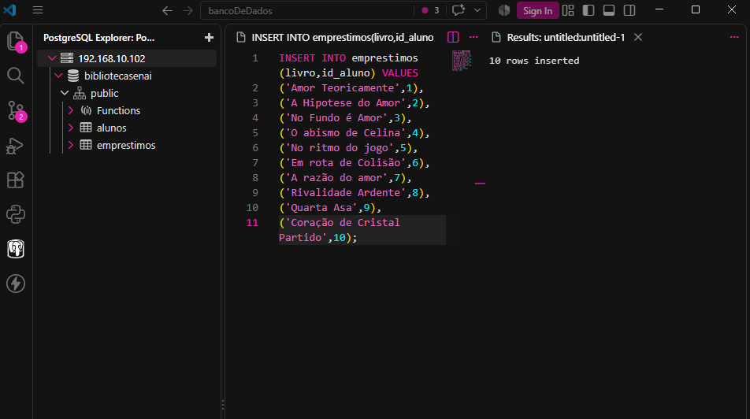
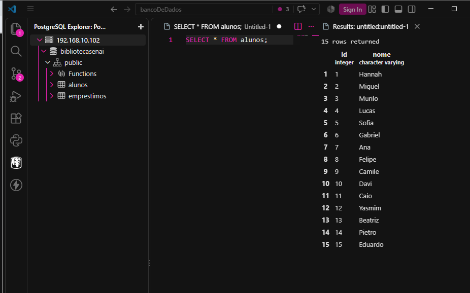
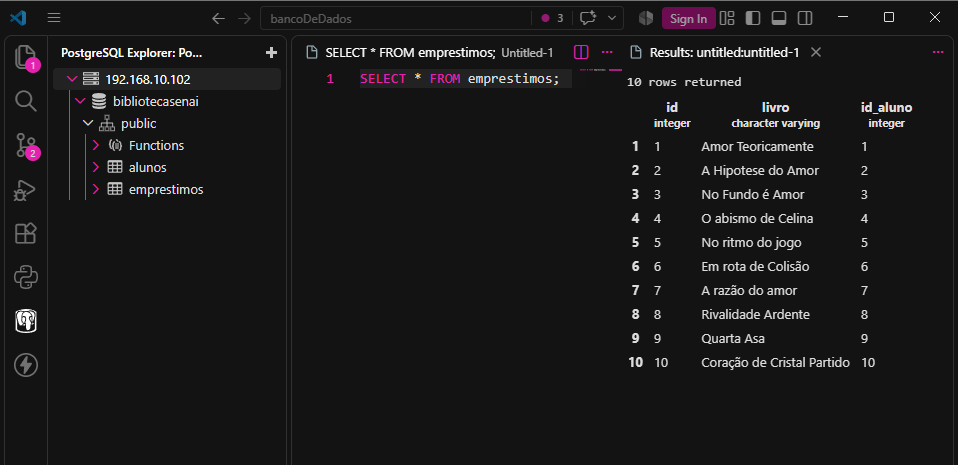
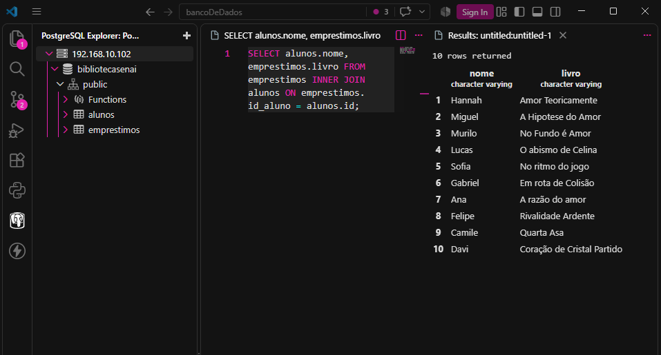
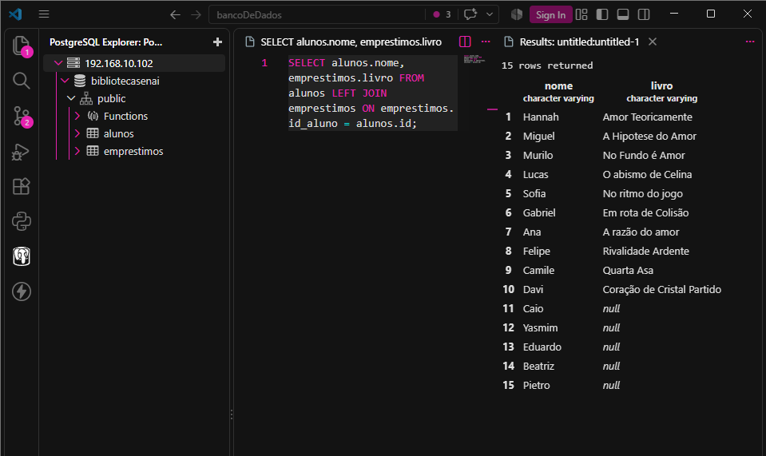
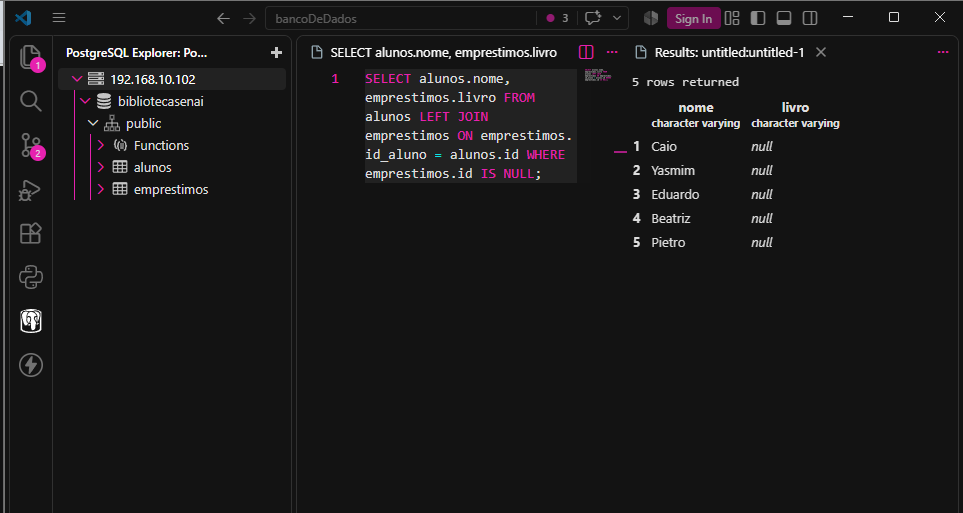

# Atividade – JOIN na Biblioteca da Escola

Nesta atividade eu fiz um banco de dados para  uma biblioteca.


O banco tem duas tabelas:

* `alunos`: onde tem os alunos da escola.

* `emprestimos`: onde tem os livros emprestados e o `id` do aluno que pegou o livro.



## Estrutura do Banco de Dados

### Tabela `alunos`

A tabela possui:

* `id`: identificador do aluno.
* `nome`: nome do aluno.

### Tabela `emprestimos`

A tabela possui:

* `id`: identificador do empréstimo.
* `livro`: nome do livro emprestado.
* `id_aluno`: identifica qual aluno pegou o livro.

## Dados 

eu cadastrei 15 alunos e 10 livros.

Os alunos:

1. Hannah
2. Miguel
3. Murilo
4. Lucas
5. Sofia
6. Gabriel
7. Ana
8. Felipe
9. Camile
10. Davi
11. Caio
12. Yasmim
13. Beatriz
14. Pietro
15. Eduardo


Foram cadastrados 10 empréstimos, porem so os alunos de 1 até 10 tem um livro.


O Caio, Yasmim, Beatriz, Pietro e Eduardo não tem nenhum livro emprestado.

---

## Consultas realizadas

### 1. Mostrar todos os dados de cada tabela

Para visualizar todos os dados da tabela `alunos`, eu utilizei:

```sql
SELECT * FROM alunos;
```


Para visualizar todos os dados da tabela `emprestimos`, eu utilizei:

```sql
SELECT * FROM emprestimos;
```


Eu fiz essas consultadas para ver os dados das duas tabelas.

---

## 2. INNER JOIN

Eu utilizei:

```sql
SELECT alunos.nome, emprestimos.livro
FROM emprestimos
INNER JOIN alunos ON emprestimos.id_aluno = alunos.id;
```


O `INNER JOIN` mostra somente os registros que possuem algo nas duas tabelas.

### Quais alunos não apareceram? Por quê?

Os alunos que não apareceram foram:

* Caio
* Yasmim
* Beatriz
* Pietro
* Eduardo

Eles não apareceram porque não tem nenhum empréstimo cadastrado.

O `INNER JOIN` mostra somente os alunos que possuem dados nas `alunos.id` e `emprestimos.id_aluno`.

---

## 3. LEFT JOIN

Eu utilizei:

```sql
SELECT alunos.nome, emprestimos.livro
FROM alunos
LEFT JOIN emprestimos ON emprestimos.id_aluno = alunos.id;
```


O `LEFT JOIN` mostra todos os alunos, mesmo aqueles que não possuem nenhum livro emprestado.

### O que apareceu na coluna `livro` para quem não pegou nenhum livro?

Para os alunos que não possuem empréstimos, apareceu:

```text
NULL
```

Isso acontece porque os alunos não tem livros na tabela de `emprestimos`.

---

## 4. Alunos que nunca pegaram livro

Eu utilizei:

```sql
SELECT alunos.nome, emprestimos.livro
FROM alunos
LEFT JOIN emprestimos ON emprestimos.id_aluno = alunos.id
WHERE emprestimos.id IS NULL;
```


### Resultado

Os alunos que nunca pegaram livro foram:

* Caio
* Yasmim
* Beatriz
* Pietro
* Eduardo

O `LEFT JOIN` mantém todos os alunos e o `WHERE emprestimos.id IS NULL` mostra os alunos que não tem empréstimo.

---

## 5. Tentativa de empréstimo para o aluno 50

Eu utilizei:

```sql
INSERT INTO emprestimos(livro,id_aluno)
VALUES ('Com Amor, Atena',50);
```


### O que aconteceu?

O banco apresentou um erro e não permitiu cadastrar o empréstimo.

### Por quê?

Porque o aluno com `id = 50` não existe na tabela `alunos`.

A tabela `emprestimos` possui uma referência:

```sql
id_aluno INT REFERENCES alunos(id)
```

Isso significa que o `id_aluno` informado no empréstimo precisa existir na tabela `alunos`.

Como não existe um aluno com `id = 50`, o banco impede o cadastro.

---
