# API de Controle de Peças

## Sobre o projeto

Este projeto foi desenvolvido para criar uma API simples para controlar as peças de um almoxarifado.

A API permite cadastrar, consultar, alterar e excluir peças. Os dados ficam armazenados em um banco de dados PostgreSQL.

O projeto foi feito utilizando PHP, PDO e PostgreSQL. Para testar as requisições da API, foi utilizado o Thunder Client no Visual Studio Code.

---

## Tecnologias utilizadas

- PHP
- PostgreSQL
- PDO
- JSON
- Thunder Client
- Visual Studio Code
- MobaXterm

---

## Estrutura do projeto

```text
almoxarifado
│
├── conexao.php
├── index.php
└── README.md

O arquivo conexao.php é responsável pela conexão com o banco de dados.

O arquivo index.php contém as operações da API.

O README.md contém as informações e explicações sobre o projeto.

Banco de dados

O banco utilizado no projeto se chama almoxarifado.

Dentro dele foi criada a tabela pecas.

A tabela possui os seguintes campos:

id
nome
categoria
fornecedor
quantidade
preco_unitario

As categorias utilizadas foram:

elétrica
mecânica
hidráulica

A quantidade não pode ser negativa e o preço unitário precisa ser maior que zero.

Conexão com o banco

A conexão com o PostgreSQL foi feita no arquivo conexao.php utilizando PDO.

O PDO é responsável por fazer a comunicação entre o PHP e o banco de dados.

A conexão foi feita utilizando informações como o endereço do servidor, a porta, o nome do banco e o usuário.

Um exemplo da conexão utilizada é:

$dsn = "pgsql:host=$host;port=$port;dbname=$dbname";

$pdo = new PDO($dsn, $user, $password);

Também foi utilizado try e catch para tratar possíveis erros na conexão.

Print da conexão

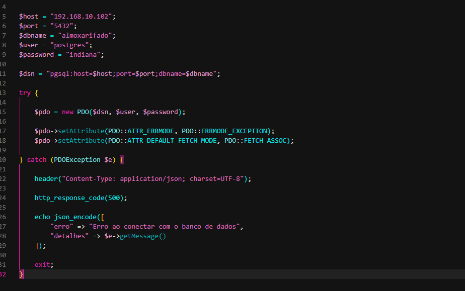

API

O arquivo index.php é a parte principal da API.

Ele verifica qual método HTTP foi utilizado:

$metodo = $_SERVER["REQUEST_METHOD"];

Com isso, o código consegue identificar se a requisição é:

POST
GET
PUT
DELETE

Os dados são enviados e recebidos em formato JSON.

POST - Cadastrar peça

O método POST foi utilizado para cadastrar novas peças no banco.

Os dados enviados pelo Thunder Client são recebidos pelo PHP e transformados em dados que podem ser utilizados pelo programa.

$dados = json_decode(file_get_contents("php://input"), true);

Depois são verificadas as informações obrigatórias e algumas regras, como a categoria, quantidade e preço.

Para cadastrar a peça no banco foi utilizado o comando INSERT.

INSERT INTO pecas
(nome, categoria, fornecedor, quantidade, preco_unitario)
VALUES
(:nome, :categoria, :fornecedor, :quantidade, :preco_unitario);

Foram cadastradas peças das três categorias.

Exemplo de cadastro
{
  "nome": "Motor elétrico",
  "categoria": "eletrica",
  "fornecedor": "EletroParts",
  "quantidade": 15,
  "preco_unitario": 450.00
}
Print do POST

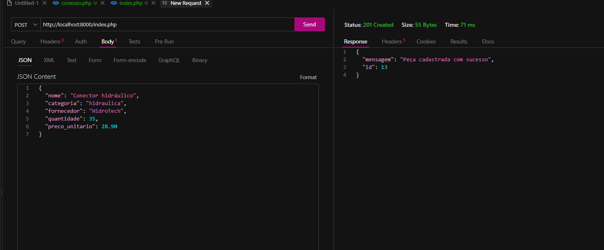

GET - Consultar peças

O método GET foi utilizado para consultar as peças cadastradas.

Foi utilizado o comando:

SELECT * FROM pecas ORDER BY id;

O PHP recebe os dados do banco e retorna as informações em formato JSON.

Print do GET

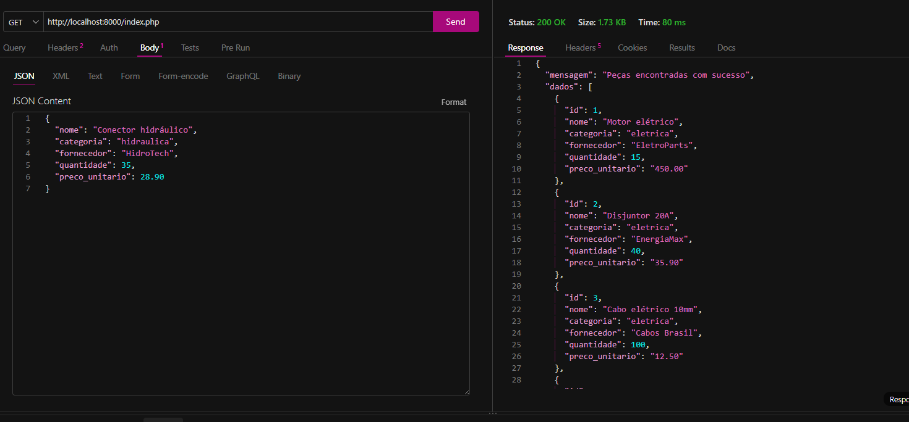

PUT - Alterar peça

O método PUT foi utilizado para alterar uma peça que já estava cadastrada.

Primeiro é informado o id da peça que será alterada.

Exemplo:

{
  "id": 1,
  "nome": "Motor elétrico atualizado",
  "categoria": "eletrica",
  "fornecedor": "EletroParts",
  "quantidade": 20,
  "preco_unitario": 450.00
}

Para fazer a alteração foi utilizado o comando UPDATE.

UPDATE pecas
SET nome = :nome,
    categoria = :categoria,
    fornecedor = :fornecedor,
    quantidade = :quantidade,
    preco_unitario = :preco_unitario
WHERE id = :id;

O WHERE é importante porque indica qual peça será alterada.

Print do PUT

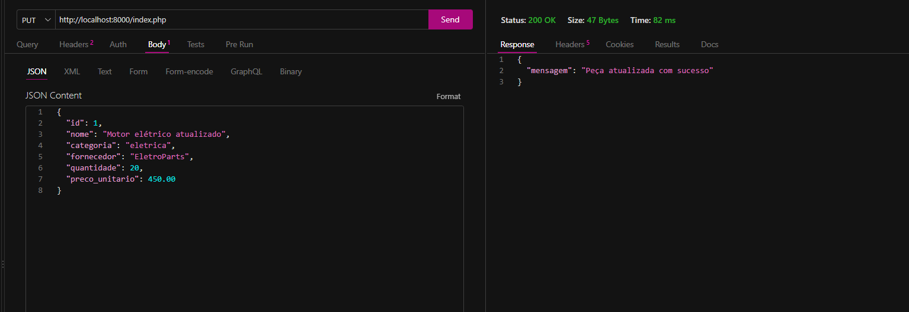

DELETE - Excluir peça

O método DELETE foi utilizado para excluir uma peça pelo seu ID.

Exemplo:

{
  "id": 12
}

Para excluir a peça foi utilizado o comando:

DELETE FROM pecas
WHERE id = :id;

O código também verifica se a peça existe antes de realizar a exclusão.

Print do DELETE

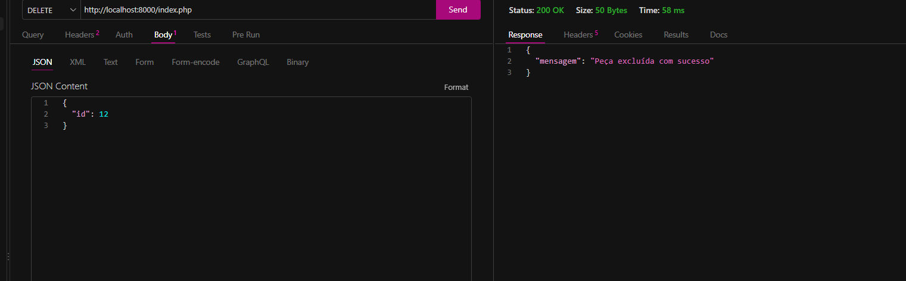

Validações

Foram adicionadas algumas validações para evitar dados incorretos.

A categoria precisa ser uma das seguintes:

eletrica
mecanica
hidraulica

A quantidade não pode ser negativa.

O preço unitário precisa ser maior que zero.

Também é necessário informar todos os campos obrigatórios no cadastro e na alteração.

Consultas SQL

Depois de realizar as operações da API, foram feitas algumas consultas SQL para analisar as informações do estoque.

Total de unidades
SELECT SUM(quantidade) AS total_unidades
FROM pecas;

O SUM foi utilizado para somar todas as quantidades das peças cadastradas.

Print

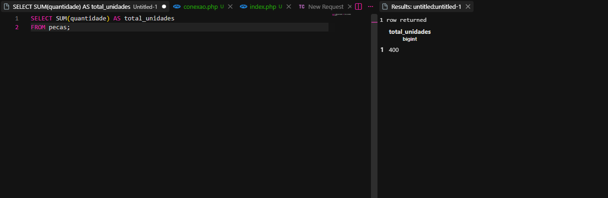

Valor total do estoque
SELECT SUM(quantidade * preco_unitario) AS valor_total_estoque
FROM pecas;

Essa consulta calcula o valor total do estoque multiplicando a quantidade pelo preço de cada peça.

Print

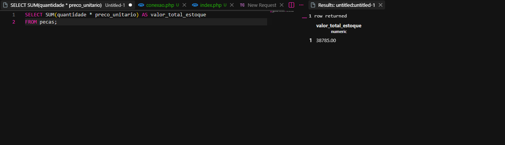

Maior preço
SELECT MAX(preco_unitario) AS maior_preco
FROM pecas;

O MAX mostra o maior preço unitário entre as peças cadastradas.

Print

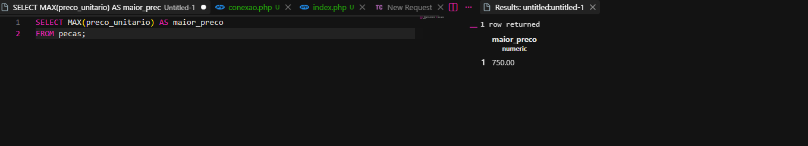

Menor preço
SELECT MIN(preco_unitario) AS menor_preco
FROM pecas;

O MIN mostra o menor preço unitário entre as peças cadastradas.

Print

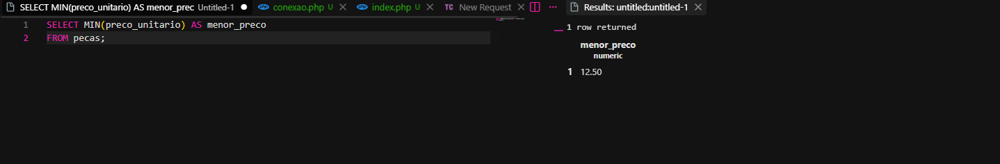

Preço médio
SELECT ROUND(AVG(preco_unitario), 2) AS preco_medio
FROM pecas;

O AVG calcula o preço médio das peças.

O ROUND foi utilizado para deixar o resultado com duas casas decimais.

Print

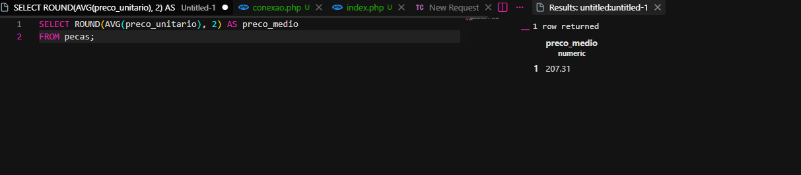

Valor total das peças elétricas
SELECT SUM(quantidade * preco_unitario) AS valor_total_eletrica
FROM pecas
WHERE categoria = 'eletrica';

Nessa consulta foi utilizado o WHERE para considerar somente as peças da categoria elétrica.

Print

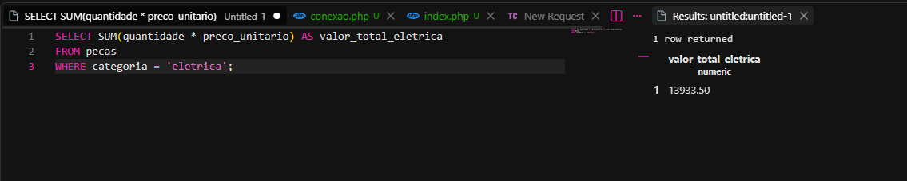

Testes

Os testes da API foram realizados utilizando o Thunder Client no Visual Studio Code.

Foram testadas as operações:

POST para cadastrar peças
GET para consultar as peças
PUT para alterar uma peça
DELETE para excluir uma peça

Também foram realizadas as consultas SQL para analisar os dados do estoque.

Como executar o projeto

Para iniciar o projeto, primeiro é necessário estar dentro da pasta almoxarifado.

Depois, no terminal, foi utilizado:

php -S localhost:8000

Depois disso, a API pode ser acessada pelo Thunder Client utilizando:

http://localhost:8000/index.php